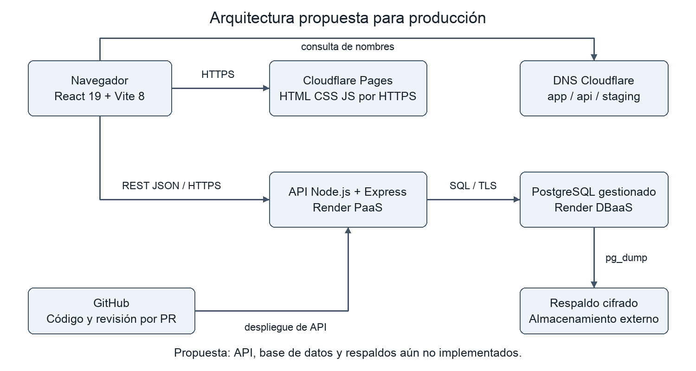
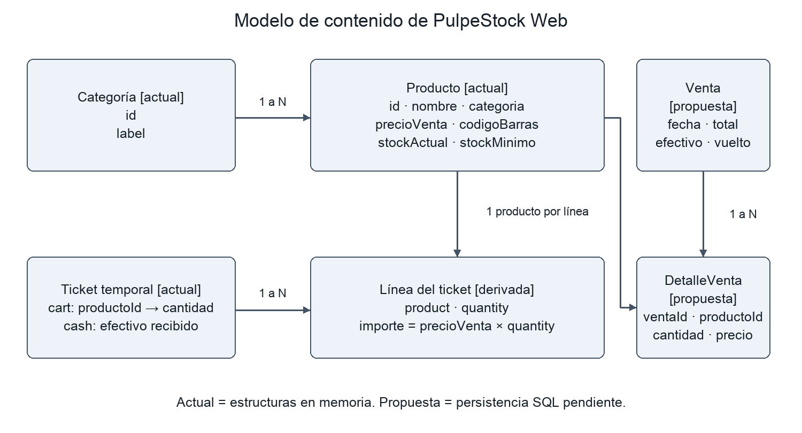
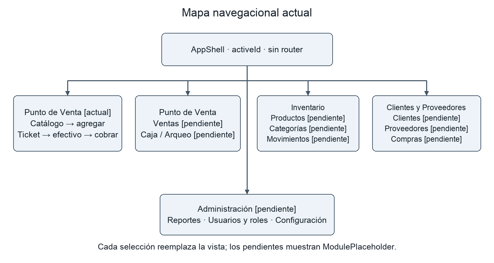
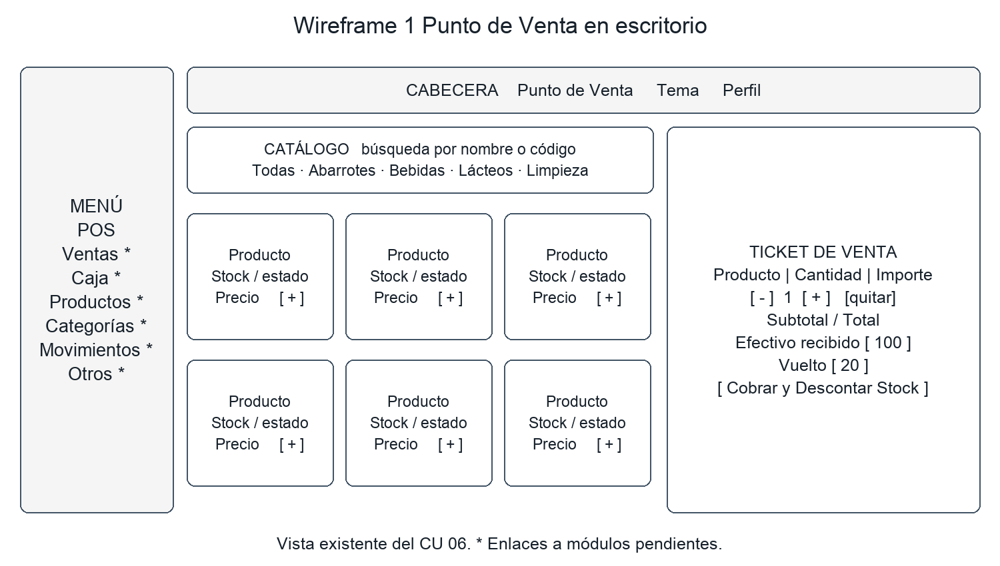
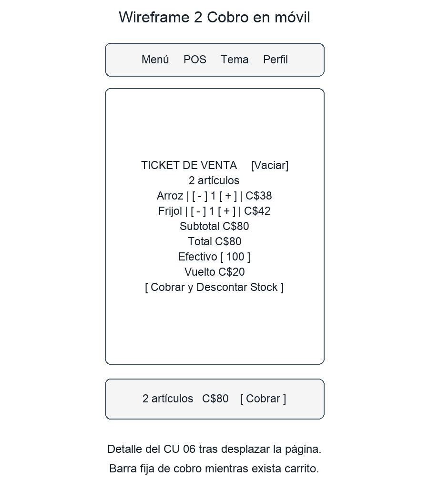
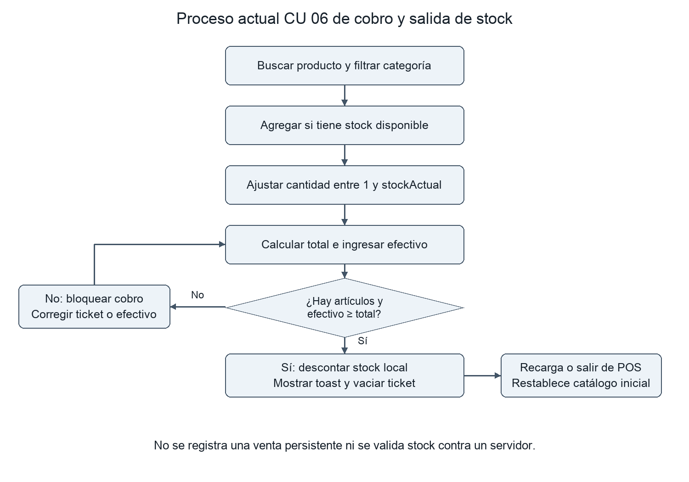
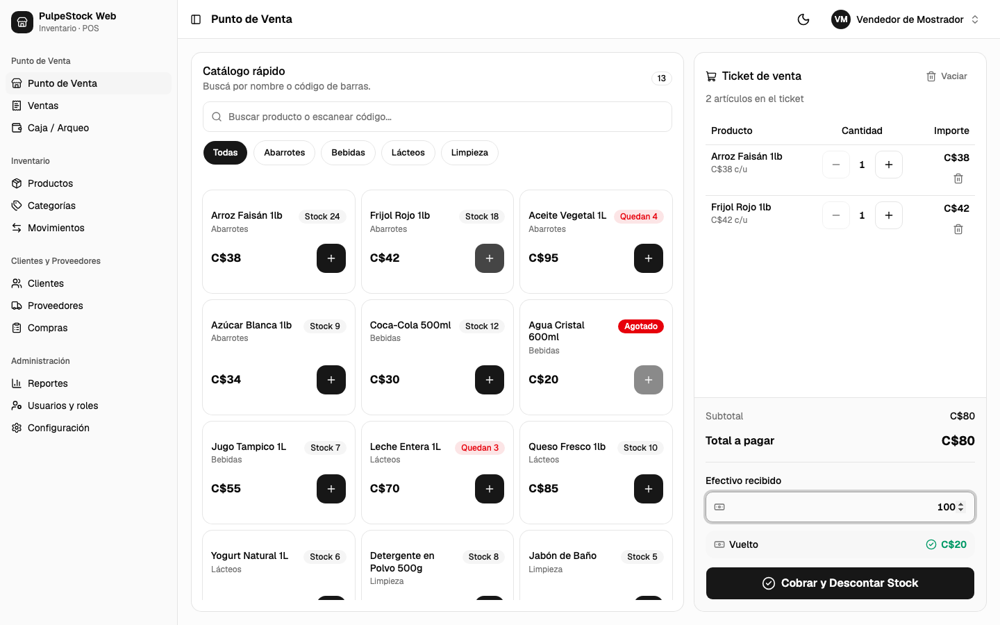
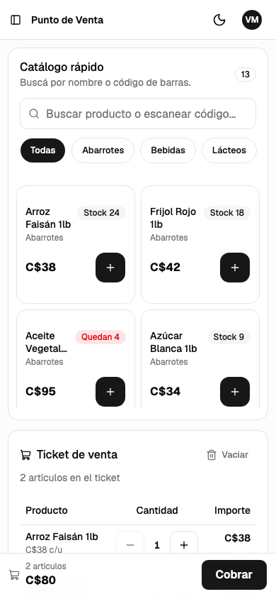
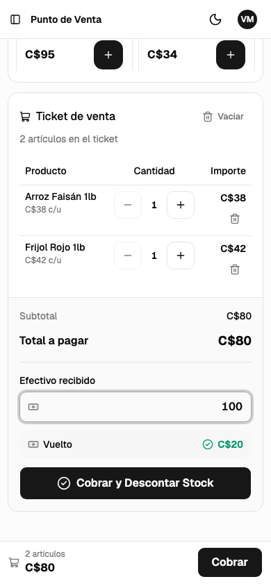

# PulpeStock Web Actividades de Semana 7

Diseño de Sistemas en Internet · Unidad III · Trabajo 6

Universidad Nacional de Ingeniería · Facultad de Ciencias y Sistemas · Ingeniería de Sistemas · V año · Modalidad sabatino

Docente Víctor Manuel Díaz Suárez · Proyecto grupal PulpeStock Web · 6 de octubre de 2026

## Alcance y conclusión

PulpeStock Web es un punto de venta e inventario para pulperías. El prototipo permite buscar productos, armar un ticket, recibir efectivo, calcular vuelto y descontar existencias locales. OOHDM se adopta para separar el dominio, la navegación y la interfaz. Para completar el sistema se propone alojamiento gestionado, una API REST y PostgreSQL con transacciones y respaldos. Estos servicios son decisiones de diseño; todavía no están implementados.

| Área | Estado verificado |
| --- | --- |
| CU-06 y shell | Implementados: catálogo, ticket, controles de cantidad, cobro, tema y navegación. |
| Datos | 13 productos y 4 categorías de muestra; catálogo, carrito y efectivo en memoria React. |
| Módulos restantes | 11 destinos navegables con ModulePlaceholder; no contienen operaciones de negocio. |
| Autenticación y producción | Pendientes: perfil y cierre de sesión demo, sin API ni base de datos conectada. |

## Organización de la entrega

Servicios Web se desarrolla en las cuatro páginas siguientes. Después se presentan la comparación metodológica, las dos fases OOHDM aplicadas, los cuatro modelos, la movilidad y las evidencias reales de ejecución. La propuesta SQL y los diagramas no certifican una implementación de backend.

Base verificada: repositorio enocgarciadev/frontend-system-design-homework-uni, commit 0f267f8f336923c98a2c7f0df226caedd539347f. Material docente: Semana 7, diapositivas 33 a 37 (páginas impresas 29 a 33).

# 1 Servicios Web Dominio y DNS

Se propone pulpestock.com como nombre del proyecto, sujeto a disponibilidad y registro. No se afirma que pertenezca al equipo ni que esté configurado. app.pulpestock.com sería la dirección canónica del punto de venta; api.pulpestock.com alojaría el servicio de negocio. staging.pulpestock.com y api-staging.pulpestock.com separarían las pruebas de la operación.

| Nombre | Tipo | Destino o propósito |
| --- | --- | --- |
| @ | NS | Servidores autoritativos asignados por Cloudflare al registrar la zona. |
| app | CNAME | Nombre real <proyecto>.pages.dev asignado al frontend. |
| api | CNAME | Nombre real <servicio>.onrender.com asignado a la API. |
| staging | CNAME | Proyecto Pages separado de pruebas. |
| api-staging | CNAME | Servicio Render separado con base de datos de pruebas. |
| www | CNAME | Alias de app; el proveedor debe asociarlo y redirigirlo por HTTPS. |
| @ | TXT | Verificación de propiedad únicamente si el proveedor la solicita. |

## Justificación de los registros

CNAME permite usar los nombres administrados por los proveedores sin fijar una IP que pueda cambiar. Un registro A sería apropiado si se eligiera un servidor con IPv4 estable; AAAA solo si el proveedor entrega IPv6. No se inventan direcciones A o AAAA porque el alojamiento propuesto no requiere una IP propia. NS delega la resolución y TXT permite verificaciones. MX se omite porque este alcance no incluye correo corporativo.

Para el dominio raíz se propone una redirección hacia app usando el servicio del proveedor. Si se conecta el raíz directamente a Pages, se debe seguir la configuración de zona y dominio personalizado de Cloudflare, en lugar de asumir un CNAME convencional en el apex. Cada nombre se registra primero en el alojamiento para verificar propiedad y emitir su certificado [2].

## Operación por ambientes

Se propone TTL de 300 segundos cuando el proveedor permita editarlo durante la puesta en marcha; después, 3600 segundos para nombres estables. Los registros proxy pueden tener TTL automático. La validación de puesta en marcha incluirá resolución DNS, certificado válido y redirección HTTP a HTTPS. Las API de producción y pruebas aceptarán solo el origen del frontend de su ambiente.

El DNS hace localizable el servicio; no autentica vendedores ni autoriza ventas. La base de datos no tendrá un nombre público para acceso desde el navegador. Fuente conceptual: Semana 7, diapositivas 7 a 9 y actividad 1.

# 1 Servicios Web Alojamiento

Se selecciona nube gestionada: distribución estática en Cloudflare Pages y API Node.js con Express en un servicio PaaS de Render, acompañado de PostgreSQL gestionado. El frontend actual produce archivos en dist mediante pnpm build, por lo que no necesita un servidor React de ejecución. La API futura concentrará las reglas de stock y ventas.

| Alternativa | Aplicación a PulpeStock | Decisión |
| --- | --- | --- |
| Compartido | Simple para archivos, pero el soporte del futuro proceso Node y su aislamiento depende del proveedor. | No elegido |
| VPS | Control de Node y SQL; el equipo asumiría parches, certificados, monitoreo y recuperación. | No elegido |
| Dedicado | Recursos propios; capacidad y administración excesivas para un prototipo de pulpería. | No elegido |
| Nube PaaS y DBaaS | Delega infraestructura y permite publicar frontend, API y datos por separado. | Elegido |
| Funciones serverless | Útiles para eventos breves; requieren gestionar conexiones SQL y límites de ejecución. | Alternativa futura |

## Tres criterios de selección

Capacidad técnica: el equipo ya utiliza JavaScript y Git; una API monolítica Node evita sumar varios servicios distribuidos. La plataforma gestionada reduce tareas de operación, aunque el equipo sigue siendo responsable del código, permisos, respaldos y restauración.

Escalabilidad: los archivos del frontend pueden distribuirse por CDN y la API ajustarse independientemente. Una única API con módulos internos de catálogo, ventas y usuarios es suficiente para el primer despliegue. Las consultas paginadas y los índices SQL preceden a considerar caché, microservicios o mensajería.

Presupuesto: el prototipo puede evaluarse con un plan de demostración; una caja operativa necesita un plan con disponibilidad continua y retención de datos adecuada. No se presupone gratuidad permanente. El presupuesto aprobado debe contemplar dominio anual, API mensual, base de datos mensual y almacenamiento de respaldos, contrastando las condiciones vigentes antes de contratar.

## Despliegue y controles propuestos

Para frontend: instalar el lockfile, compilar y publicar dist. Para API: crear primero el backend, configurar secretos fuera de Git y aplicar migraciones. Render documenta el despliegue de Express [3]; la guía Pages muestra la publicación de dist [2]. Estas guías orientan la propuesta y no prueban un despliegue de este repo.

Cada PR se valida antes de integrarse. Staging utiliza datos de muestra y credenciales distintas. La promoción a producción exige prueba de cobro, restauración y revisión de permisos; se conserva la versión anterior del frontend para rollback. El servidor Vite usado para capturas es local y no sustituye el alojamiento productivo.

# 1 Servicios Web Gestión de datos

Se elige PostgreSQL porque categorías, productos, ventas, detalles y movimientos forman relaciones estructuradas. Una venta debe registrar sus líneas y disminuir existencias como una sola transacción. Un diseño NoSQL también podría almacenar documentos, pero no aporta una ventaja concreta para este volumen y exigiría resolver las mismas reglas de integridad.

## Persistencia propuesta para CU 06

Categoría conservará id y label. Producto conservará los siete campos actuales y una referencia a Categoría. Venta almacenará fecha, usuario, total, efectivo, vuelto y una clave de idempotencia. DetalleVenta conservará producto, cantidad y precio unitario al momento del cobro; así, un cambio posterior de precio no altera el historial. MovimientoStock registrará producto, tipo de movimiento, cantidad, referencia y responsable.

Los precios se almacenarán como NUMERIC(12,2), los códigos como texto y las cantidades como enteros para los productos unitarios de muestra. Se propone NOT NULL, claves foráneas, stockActual >= 0, precioVenta >= 0 y cantidad > 0. codigoBarras e idempotencia tendrán unicidad cuando corresponda. Los productos históricos se desactivarán en vez de borrarlos si una venta los referencia.

## Transacción de cobro y concurrencia

La API recibirá identificadores y cantidades, nunca confiará en el total enviado por el cliente. Dentro de BEGIN bloqueará las filas de productos en orden estable, validará existencias, calculará importes con precios del servidor, guardará Venta y DetalleVenta y descontará stock; COMMIT confirma todo. Si falla alguna regla, ROLLBACK no deja una venta parcial. La misma clave de idempotencia devolverá la venta ya registrada para evitar duplicarla al reintentar.

Hoy confirmSale solo modifica useState y vacía el carrito; no ejecuta SQL. La prueba de recarga restableció Arroz Faisán de 23 a 24. Usuarios, clientes, proveedores y compras pertenecen al roadmap; no se describen como tablas ya desplegadas.

## Respaldo y recuperación propuestos

Se propone pg_dump en formato custom cada noche, cifrado y enviado a almacenamiento separado de la base, con retención de 7 copias diarias y 4 semanales. Objetivos iniciales: RPO de 24 horas y RTO de 4 horas; son metas a validar, no garantías. El administrador comprobará ejecución y tamaño, y restaurará una copia mensualmente en una base aislada con pg_restore [4].

La prueba de restauración comprobará conteo de productos, ventas y detalles, referencias y una venta de prueba; documentará duración y resultado. Un fallo de copia requiere alerta y revisión. Credenciales de respaldo con acceso mínimo, conexión TLS y secretos separados de Git. El esquema se versionará mediante migraciones; caché en memoria no es necesaria para los 13 productos actuales.

# 1 Servicios Web Arquitectura de integración

La arquitectura actual es navegador → componentes React → catálogo y estado local. No existe una comunicación HTTP de negocio ni integración externa. La arquitectura objetivo agrega una API REST monolítica, PostgreSQL y almacenamiento externo para respaldo; todo ello se identifica como propuesto.

Figura 1 Arquitectura propuesta y protocolos de comunicación

| Interfaz propuesta | Contrato mínimo |
| --- | --- |
| GET /api/v1/productos | Consulta autenticada; filtros por nombre, código y categoría; respuesta JSON paginada. |
| POST /api/v1/ventas | Cantidades, efectivo y clave idempotente; calcula total y valida stock en el servidor. |
| Respuesta de venta | 201 con id, total, vuelto y existencias; 409 si cambió stock; 422 para entradas inválidas. |
| API → PostgreSQL | Consultas SQL parametrizadas; conexión privada del proveedor y TLS según su configuración. |

Las llamadas cliente → API usarán HTTPS y JSON; el navegador no recibirá credenciales SQL. La API aplicará autenticación real y permisos de vendedor o administrador antes de procesar una venta. Sesión con cookie HttpOnly, Secure y protección CSRF según el diseño final; CORS restringido a los orígenes de cada ambiente.

Ante falta de red, el cliente futuro conservarará el ticket visible y no mostrará éxito sin respuesta confirmada. Si la respuesta se pierde, reintentará con la misma clave idempotente. La propuesta no incluye pagos electrónicos, SOAP, Kafka ni RabbitMQ: CU-06 maneja efectivo y no requiere esos servicios. GitHub provee código y revisión; el respaldo externo permite recuperación separada.

Criterio de transición a producción: API desplegada, migraciones aplicadas, autenticación verificada, venta concurrente sin stock negativo y restauración demostrada. En esta entrega se documenta el diseño de esos servicios; la ejecución comprobada sigue siendo frontend.

# 2 Metodología Comparación y selección

La comparación se aplica a un sistema con productos relacionados con categorías, un carrito interactivo y un menú de 12 módulos. Solo POS tiene reglas de negocio implementadas. No se encontró evidencia de un proceso UML formal previo; por ello no se presupone que el equipo ya use WAE.

| Enfoque | Ajuste al proyecto | Límite y decisión |
| --- | --- | --- |
| HDM | Describe entidades, componentes, índices y enlaces del catálogo. | Sirve para estructura hipermedial; aborda menos el cobro dinámico y despliegue. |
| RMM | Parte de relaciones Producto-Categoría y de vistas parciales de catálogo y ticket. | Base relacional útil; sus 7 pasos son menos directos para separar la interfaz reactiva existente. |
| OOHDM | Separa dominio, navegación, interfaz abstracta e implementación; permite refinar POS y módulos futuros. | Elegido como método principal; las reglas transaccionales se complementan con especificación de proceso. |
| WAE | Estereotipos UML distinguen páginas cliente, servidor y formularios. | Es una extensión UML, no un método completo. Útil al modelar la API futura dentro de un proceso OO. |

## Elección y razones técnicas

Se elige OOHDM por cuatro razones. Primero, permite mantener Producto y Categoría independientes de sus tarjetas visuales: el modelo conceptual expresa precio y stock, mientras la interfaz define cómo mostrarlos. Esa separación ya se observa entre products.js y ProductCard.

Segundo, explicita la navegación. navigation.js enumera destinos y AppShell decide qué vista mostrar; el diseño navegacional distingue enlaces existentes de funcionalidades pendientes y evita confundir una entrada del menú con un módulo terminado.

Tercero, separa interfaz de dominio. El mismo ticket tiene presentación lateral en escritorio y secuencial en móvil; sus cantidades y total conservan el mismo significado. OOHDM permite describir ambas representaciones sin duplicar el negocio.

Cuarto, sus fases iterativas favorecen el avance incremental: CU-06 ofrece un primer ciclo funcional sobre el que se pueden incorporar persistencia y autenticación sin diseñar todo el roadmap como si estuviera concluido.

## Dos fases aplicadas y artefactos

Diseño conceptual: se produce el esquema de Producto, Categoría, Ticket temporal y Línea derivada, con campos, relaciones y reglas concretas. Diseño navegacional: se produce el mapa de AppShell, POS y destinos pendientes, junto con nodos, enlaces e índices. Ambas fases se materializan en las páginas siguientes y en SVG editables dentro de diagramas/. Fuente metodológica: Semana 7, diapositivas 22 a 27.

# 3 Contenido Fase conceptual de OOHDM

El modelo parte de las estructuras realmente usadas por CU-06. Actual significa que existe como datos o estado en el frontend; no significa que sea una tabla SQL. Venta y DetalleVenta se añaden como proyección del cobro persistente, distinguidas en el diagrama.

Figura 2 Modelo de contenido actual y extensión propuesta

| Objeto | Campos y relación |
| --- | --- |
| Categoría | id, label. Cuatro registros: abarrotes, bebidas, lacteos, limpieza. Una categoría agrupa varios productos. |
| Producto | id, nombre, categoria, precioVenta, stockActual, stockMinimo, codigoBarras. id estable; categoria referencia un id de categoría. |
| Ticket temporal | cart = {productoId: cantidad}; cash = texto de entrada. No hay id de venta ni fecha persistente. |
| Línea derivada | entries une cart con productById. quantity es cantidad y product conserva precio y stock. Total de línea = precioVenta × quantity. |

## Reglas aplicadas al catálogo real

Arroz Faisán 1lb cuesta C$38 y empieza con 24 unidades; Frijol Rojo 1lb cuesta C$42 y empieza con 18. Su venta de una unidad de cada uno totaliza C$80. Agua Cristal 600ml tiene stock cero y no se puede agregar. Aceite Vegetal 1L tiene 4 unidades y umbral 5, por lo que muestra stock bajo.

La cantidad se limita al stock local; el botón de decrementar se bloquea en 1, y eliminar quita la línea completa. El total coincide con el subtotal: no se calculan impuestos en CU-06. Las categorías son índices de acceso al catálogo, no pantallas CRUD actuales. Fuente: src/data/products.js y src/features/pos/PosScreen.jsx.

# 3 Navegación Fase navegacional de OOHDM

AppShell inicia con activeId = pos. La selección del menú cambia ese estado y reemplaza el contenido dentro del shell. No hay router, URLs por módulo ni enlaces de navegación profunda. El mapa representa enlaces reales del menú y señala el destino pendiente, sin suponer operaciones CRUD.

Figura 3 Nodos y enlaces navegables del sistema actual

## Nodos estructuras de acceso y contexto

Nodo POS: catálogo, ticket y cobro dentro de la misma vista. Índice de categorías: Todas, Abarrotes, Bebidas, Lácteos y Limpieza filtran la lista; la búsqueda por nombre o código también filtra y no abre una ficha de producto. Agregar establece una línea del ticket; eliminar y Vaciar modifican el contexto del carrito.

Nodos de reserva: Ventas, Caja / Arqueo, Productos, Categorías, Movimientos, Clientes, Proveedores, Compras, Reportes, Usuarios y roles y Configuración. Todos tienen entrada de menú y título real, pero su cuerpo es ModulePlaceholder. El regreso a POS se hace por el mismo menú.

En móvil, el disparador abre el menú lateral temporal. En escritorio, el menú es visible y puede colapsarse. Tema y perfil son controles del shell; cerrar sesión solo emite una notificación de demostración, sin terminar una sesión autenticada.

## Consecuencia real de navegar

Al salir de POS se desmonta PosScreen; al regresar se inicializa otra vez PRODUCTS. El ticket y las ventas locales no se conservan entre módulos ni recargas. La futura navegación con rutas y permisos es una mejora propuesta, no parte de este mapa. Fuente: src/components/layout/AppShell.jsx, AppSidebar.jsx y navigation.js.

# 3 Presentación Wireframe de escritorio

Wireframe 1 describe la vista clave de selección de productos y ticket del CU-06 existente. El catálogo ocupa el espacio flexible y el ticket una columna de 420 px desde lg. La cabecera conserva acceso a menú, tema y perfil; los enlaces de módulos pendientes se muestran con asterisco en este boceto.

Figura 4 Wireframe de Punto de Venta en escritorio

## Especificación de interfaz abstracta

Objeto producto: nombre, categoría, estado de stock y precio; acción agregar. Objeto línea: nombre, precio unitario, cantidad, importe y acciones aumentar, disminuir y quitar. Objeto cobro: subtotal, total, efectivo y vuelto; acción confirmar habilitada cuando el ticket tiene artículos y el efectivo alcanza.

El catálogo y las líneas del ticket tienen scroll interno en escritorio; la búsqueda y los totales permanecen disponibles. Producto agotado presenta estado textual y botón deshabilitado. Stock bajo se identifica con cantidad, además del color. El wireframe es un artefacto de diseño, mientras la captura posterior es evidencia de la app ejecutada.

La implementación asociada usa ProductCatalog, ProductCard, SalesTicket y PosScreen. Se mantiene una sola lógica del ticket para los dispositivos, evitando diseñar módulos inexistentes como si fueran pantallas funcionales.

# 3 Presentación Wireframe de cobro móvil

Wireframe 2 describe la vista de revisión y cobro móvil del mismo CU-06 tras desplazar la página. Es un segundo estado clave de presentación: el usuario revisa líneas, efectivo y vuelto antes de cobrar. No representa un módulo ni una ruta nueva.

Figura 5 Wireframe de revisión del ticket y cobro móvil

Debajo de lg, catálogo y ticket se apilan. La barra fija muestra cantidad y total cuando hay artículos. Si el efectivo no alcanza, Cobrar dirige el foco hacia el campo; cuando alcanza, confirma la venta local. El espacio inferior y safe-area-inset-bottom reservan acceso al botón en dispositivos con área segura.

# 3 Proceso Cobro y salida de stock

El proceso crítico documentado es confirmSale del CU-06 actual. Las validaciones se ejecutan en el cliente contra el catálogo local. La rama de insuficiencia de efectivo impide confirmar; el cobro válido actualiza el stock en memoria y limpia el ticket.

Figura 6 Flujo actual de venta en efectivo

Precondiciones: productos de muestra cargados, carrito no vacío y cantidades limitadas al stock local. Postcondiciones de éxito: catálogo disminuido, notificación Venta concretada, carrito vacío y efectivo vacío. Ejemplo comprobado: arroz 24 → 23, frijol 18 → 17, total C$80 y vuelto C$20.

No hay persistencia, conciliación de caja, factura registrada ni control multiusuario. En producción la validación debe repetirse en el servidor y la escritura ser atómica, como se propone en Gestión de datos. La recarga o desmontaje de POS restablece los datos iniciales y no constituye una recuperación de ventas.

# 4 Movilidad Perfil y enfoque

## Usuario y contexto de uso

El perfil objetivo de diseño es vendedor de mostrador o propietario de pulpería en Nicaragua, que cobra ventas pequeñas en efectivo y consulta existencias durante la atención. En mostrador puede usar una computadora con mouse y teclado; al desplazarse por el negocio puede usar un teléfono táctil. Estos contextos son supuestos de diseño del proyecto, no resultados de entrevistas.

Se contempla conectividad Wi-Fi o datos móviles con interrupciones y dispositivos de capacidad moderada. Precio en córdobas, estados explícitos de stock, búsqueda breve y botones alcanzables ayudan a la atención rápida. El texto Buscar o escanear no prueba integración con una cámara o lector: hoy se compara un código simulado como texto.

## Enfoque elegido y justificación

Se mantiene responsive con reglas mobile-first: el estilo base apila paneles y emplea dos columnas de tarjetas; las variantes sm, md, lg y 2xl amplían el layout [5]. Este enfoque conserva una sola aplicación y evita versiones separadas por dispositivo. Responde al uso táctil móvil sin perder el ticket lateral en escritorio.

No se declara PWA: no se encontró manifiesto ni service worker. El estado en memoria no equivale a soporte offline ni a sincronización. El cobro comercial sin red requiere diseñar persistencia y resolución de conflictos; para el primer backend propuesto se exige respuesta confirmada del servidor.

| Breakpoint | Adaptación actual | Fuente |
| --- | --- | --- |
| 640 px sm | Grilla de 2 a 3 tarjetas; aumentan padding y tamaño del título. | ProductCatalog, AppShell |
| 768 px md | Menú temporal móvil pasa a sidebar de escritorio. | use-mobile, sidebar |
| 1024 px lg | POS pasa de apilado a catálogo + ticket de 420 px; scroll interno y sin barra fija móvil. | PosScreen, SalesTicket |
| 1536 px 2xl | Catálogo pasa de 3 a 4 tarjetas por fila. | ProductCatalog |

Existe además min-[2000px] para 5 tarjetas. Los valores anteriores son los defaults Tailwind no redefinidos en este repo; con la configuración habitual de fuente raíz corresponden a 40, 48, 64 y 96 rem. La prueba inspeccionó anchos a ambos lados de los cuatro puntos de quiebre.

# 4 Movilidad Evidencia de escritorio

Captura real del frontend ejecutado con Vite en Chromium sin interfaz, viewport 1440 × 900 CSS px, escala 1 y tema claro. Fecha: 6 de octubre de 2026. Escenario: una unidad de Arroz Faisán y una de Frijol Rojo, efectivo C$100; total C$80 y vuelto C$20.

Figura 7 App ejecutada en escritorio 1440 por 900

A este ancho el catálogo y el ticket se ven simultáneamente. Se muestran tres tarjetas por fila, sidebar abierto, total, vuelto y acción de cobro al pie del ticket. La cantidad disponible permanece sin descuento hasta confirmar la venta.

## Comparación con móvil

En 390 px la misma venta tiene catálogo de dos columnas y ticket debajo. La navegación se oculta en menú temporal y una barra fija conserva el total y Cobrar. Revisar líneas y efectivo requiere desplazar la página. Las dos capturas móviles de la página siguiente muestran el catálogo y el detalle de cobro del mismo carrito.

Las capturas se obtuvieron por automatización de un navegador real; no son diseños generados. La emulación de viewport y entrada táctil no reemplaza una prueba física en teléfono ni simula el teclado virtual o una conexión móvil lenta.

# 4 Movilidad Evidencia móvil comparativa

Misma pantalla CU-06 y misma venta que en escritorio. Ambas imágenes tienen viewport 390 × 844 CSS px. La izquierda muestra catálogo y comienzo del ticket; la derecha muestra la revisión del cobro después de desplazar la página. No se confirma la venta entre esas dos tomas.

La barra fija conserva C$80 y Cobrar en ambos estados. El detalle muestra las líneas C$38 y C$42, efectivo C$100 y vuelto C$20. El catálogo y el ticket conservan los mismos datos del escritorio; cambia la disposición y el recorrido visual.

Los límites max-h de 62svh en catálogo y 55svh en ítems del ticket permiten desplazamiento interno. Se necesita validar en equipos físicos la interacción entre esos scrolls, la barra fija y el teclado virtual antes de usarlo como caja productiva.

# Verificación y trazabilidad de la entrega

## Resultados observados

| Comprobación | Resultado |
| --- | --- |
| Compilación pnpm build | Correcta con Vite 8.2.2 y React 19.2.8 del lockfile. |
| Revisión pnpm lint | Sin errores; 20 advertencias preexistentes en componentes y hooks. |
| Cobro en dos viewports | C$50 bloquea total C$80; C$100 permite cobro, notificación y vaciado del ticket. |
| Stock y recarga | Arroz 24 → 23 al cobrar; vuelve a 24 al recargar. |
| Navegación | Productos abre la pantalla que informa que aún no está implementado. |
| Consola de navegador | Sin excepciones pageerror en los dos escenarios de cobro. |
| Quiebres de layout | 639/640, 767/768, 1023/1024 y 1535/1536 px; sin overflow horizontal global. |

## Límite de la prueba y mejora propuesta

A 1024 px, el ticket fijo y sidebar abierto dejan tarjetas de aproximadamente 80 px de ancho. No hay overflow global, pero el catálogo queda comprimido. Se recomienda revisar el paso a dos paneles o colapsar el sidebar en ese intervalo; esta entrega no modifica el comportamiento de la app. Tampoco certifica accesibilidad completa, seguridad del backend ni rendimiento en redes lentas.

## Cobertura de criterios de Semana 7

Actividad 1: cuatro páginas con decisiones DNS, alojamiento, SQL, respaldo y arquitectura. Actividad 2: comparación aplicada, cuatro razones y dos fases OOHDM con artefactos. Actividad 3: contenido, navegación, dos wireframes y flujo crítico. Actividad 4: perfil, contexto, responsive mobile-first, cuatro breakpoints y comparación visual real.

Fuentes de evidencia: products.js, navigation.js, AppShell.jsx y features/pos/*.jsx. Evidencia reproducible: capturas/evidencia.json y scripts/capturar.cjs. Diagramas editables: diagramas/*.svg; imágenes de entrega: diagramas/*.png. Texto fuente y generación: informe.md, contenido.json y scripts/construir_documento.py.

La sustentación oral de 10 a 15 minutos exigida en la diapositiva 37 corresponde al equipo: las decisiones y límites de este informe sirven de base para esa exposición, sin atribuir participación individual no registrada.

# Referencias

[1] Díaz Suárez, Víctor Manuel. Material Didáctico Diseño de Sistemas en Internet 2026, Semana 7. UNI, Facultad de Ciencias y Sistemas. Diapositivas 7-14: servicios; 18-20: perspectivas y movilidad; 22-27: métodos; 33-37: actividades y criterios. Archivo original del proyecto, consultado en modo de lectura.

[2] Cloudflare. Pages: Custom domains y guía Vite 3. Consultadas el 6 de octubre de 2026. La guía indica publicar dist; la compatibilidad de Vite 8 se acredita aquí con build local, no con un despliegue en Cloudflare. https://developers.cloudflare.com/pages/configuration/custom-domains/ y https://developers.cloudflare.com/pages/framework-guides/deploy-a-vite3-project/

[3] Render. Deploy a Node Express App on Render. Consultada el 6 de octubre de 2026. https://render.com/docs/deploy-node-express-app

[4] PostgreSQL. Documentación SQL Dump. Consultada el 6 de octubre de 2026. https://www.postgresql.org/docs/current/backup-dump.html

[5] Tailwind CSS. Responsive design. Breakpoints predeterminados y reglas mobile-first. Consultada el 6 de octubre de 2026. https://tailwindcss.com/docs/responsive-design

[6] PulpeStock Web. Código y documentación de proyecto, commit 0f267f8f336923c98a2c7f0df226caedd539347f. https://github.com/enocgarciadev/frontend-system-design-homework-uni/tree/0f267f8f336923c98a2c7f0df226caedd539347f

## Base bibliográfica del material docente

Garzotto, F., Paolini, P. y Schwabe, D. (1993). HDM: A model-based approach to hypertext application design. ACM Transactions on Information Systems, 11(1).

Isakowitz, T., Stohr, E. A. y Balasubramanian, P. (1995). RMM: A methodology for structured hypermedia design. Communications of the ACM, 38(8).

Schwabe, D. y Rossi, G. (1998). An object oriented approach to Web-based application design: OOHDM. Theory and Practice of Object Systems, 4(4).

Conallen, J. (2002). Building Web Applications with UML. Segunda edición. Addison-Wesley.

Estos antecedentes se citan como bibliografía de la Semana 7. La comparación de este informe sigue las definiciones y fases presentadas en ese material.
